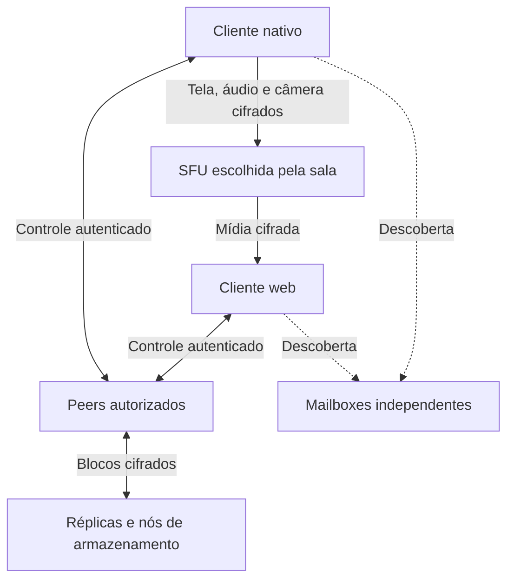

**Plano de produto e implementação — substituto distribuído do Discord**

Versão 1.0 — 23 de setembro de 2026. Proposta de engenharia; nenhuma implementação ou medição de desempenho foi realizada nesta etapa. Os valores operacionais são metas iniciais a validar.

**1. Objetivo e contrato do produto.** Construir um aplicativo em que um grupo de amigos possa substituir seu uso cotidiano do Discord: comunidades privadas, canais, mensagens diretas, voz, câmera e transmissão de jogos com áudio. A comunidade conserva identidade, membros e configuração quando uma máquina ou um prestador de infraestrutura desaparece.

O núcleo do produto é: abrir o aplicativo nativo, entrar num canal de voz, transmitir um jogo com áudio e convidar amigos que podem assistir e conversar no navegador. Captura web é uma facilidade adicional conforme a plataforma; no Linux/Wayland, a captura nativa é o caminho suportado para jogos.

O projeto é independente do protocolo e da infraestrutura do Discord. O objetivo de resiliência é remover dependências obrigatórias de um operador, domínio ou servidor específico. Conectividade global, anonimato e impossibilidade absoluta de bloqueio não são garantias.

**2. Escopo do lançamento utilizável.** A primeira versão precisa permitir que um grupo mantenha seu uso diário no aplicativo durante uma semana sem voltar ao Discord por falta de uma função central.

| Área | Funcionalidades exigidas |
| --- | --- |
| Identidade | Perfil local, dispositivos autorizados, exportação e recuperação de credenciais |
| Comunidades | Múltiplas comunidades, categorias, canais de texto e voz, canais privados e convites |
| Conversa | Mensagens, respostas, edição, exclusão, reações, menções, não lidas e busca no histórico disponível |
| DMs | Contatos por convite, conversa individual, grupo privado e chamada |
| Voz | Mute, deafen, push-to-talk, dispositivo de entrada/saída, volume por pessoa e indicação de fala |
| Vídeo | Câmera, tela/janela, áudio do jogo separado do microfone, qualidade adaptativa e tela cheia |
| Administração | Cargos, permissões por canal, expulsão, banimento, mute administrativo e recuperação da administração |
| Arquivos | Miniaturas, download explícito, retomada, fontes múltiplas e replicação cooperativa autorizada |
| Continuidade | Reconexão, descoberta redundante, migração de SFU e histórico disponível em outros participantes |
| Operação | Limites de disco/upload, diagnósticos locais, instalação e atualização assinada |

Alvo inicial de validação por comunidade: 50 identidades, 12 participantes simultâneos em voz e dois transmissores de tela. Cada espectador recebe uma transmissão principal em alta qualidade; outras visualizações ficam reduzidas ou pausadas. São limites de suporte iniciais, não limites criptográficos nem benchmarks já alcançados.

Bots com permissões explícitas, integrações, threads, aplicativo móvel nativo, clientes de captura para Windows/macOS e comunidades grandes entram após o lançamento inicial. O navegador já permite participação de amigos em outros sistemas. Não desenvolver monetização, marketplace, recomendação de servidores ou feed público durante a primeira versão.

**3. Experiência e plataformas.** A interface usa uma organização familiar: comunidades, canais, conversa, participantes e controles persistentes de chamada. Estados de rede aparecem como ações compreensíveis: “Reconectando”, “Aguardando uma fonte do arquivo” e “Histórico disponível até…”. Hashes, épocas criptográficas e nomes de protocolos ficam no diagnóstico.

| Cliente | Responsabilidade | Limitação explícita |
| --- | --- | --- |
| Desktop Linux | Experiência completa, captura PipeWire, chamadas, armazenamento e uploads em segundo plano | Exige instalação e permissões do sistema |
| Navegador/PWA | Chat, voz, câmera, assistir, download e réplica enquanto ativo | Suspensão, quotas e limpeza do navegador impedem prometer disponibilidade permanente |
| Nó auxiliar | SFU, mailbox ou armazenamento cifrado, com papéis habilitados separadamente | SFU necessita conectividade e banda apropriadas; nenhum papel implica ser administrador |

Base de UI proposta: Qt Quick/QML com núcleo Rust via CXX-Qt no desktop; TypeScript no cliente web. A interoperação Qt/Rust é suportada por CXX-Qt [R12]. As duas interfaces compartilham schemas e regras do núcleo, não necessariamente seus componentes visuais. A decisão de UI não pode bloquear a prova inicial de mídia, que começa com CLI e uma página de reprodução.

No navegador, criptografia e validação compartilhadas podem ser compiladas para WASM, mas persistência e rede permanecem adaptadores da plataforma. Não supor que Tokio, SQLite nativo ou sockets UDP funcionem em WASM. Cliente web usa IndexedDB/armazenamento disponível e informa quando não pode conservar uma réplica.

**4. Arquitetura e fronteiras de confiança.** Separar três planos: mídia em tempo real; controle e sincronização; conteúdo armazenado. Uma queda da SFU não apaga comunidade, chaves, catálogo ou contatos.



O diagrama mostra responsabilidades, não exige que todos os dispositivos mantenham conexões com todos. Pequenos grupos podem começar com conexões diretas; o controle usa poucos vizinhos, recuperação incremental e encaminhamento cifrado quando necessário.

Transportes do protocolo:

- Controle: WebRTC DataChannel entre peers, com ponte WebSocket que só encaminha envelopes cifrados como alternativa. Bootstrap HTTPS/WSS permite iniciar sem que uma conexão P2P já exista.
- Mídia: WebRTC com ICE/STUN/TURN, diretamente ou por SFU.
- Arquivos: transferências verificáveis em streams/chunks com retomada; prioridade menor que a chamada.
- Descoberta: interface independente do transporte, inicialmente dead-drop HTTPS/WSS e contatos diretos.

Não adicionar Iroh, libp2p e uma DHT simultaneamente. Para esta primeira versão, WebRTC atende nativo e navegador; o protocolo de objetos é independente dele. Iroh continua sendo alternativa para o armazenamento nativo se as medições mostrarem benefício suficiente para justificar outro caminho de rede. Não confundir suporte WASM com capacidade de abrir sockets QUIC arbitrários no navegador.

**5. Decisões da stack e prova de integração.** Núcleo Rust/Tokio, metadados em SQLite no desktop, arquivos em blocos endereçados por conteúdo. Captura e pipeline nativo no modelo OBS: libpipewire direto para captura (streams PipeWire do portal XDG) e FFmpeg para encode e mux RTP — decisão registrada no M0 após verificação de que ffmpeg/rtp interopera com a SFU sem depender de plugins dinâmicos de terceiros. SFU mediasoup, inicialmente com o controlador Node.js/TypeScript oficial para reduzir trabalho de integração; possibilidade de controlador Rust após o caminho estar validado. Viewer web com mediasoup-client e APIs WebRTC.

O caminho nativo→SFU usa PlainTransport do mediasoup (RTP puro, sem ICE/SDP no ingest), o que remove a necessidade de adaptador WebRTC no primeiro marco. O que ainda precisa de verificação no caminho real: RTCP→keyframe (PLI/FIR), controle de congestionamento e E2EE via SFrame antes do encode ou no mux. Se a integração exigir manutenção excessiva, a alternativa é libmediasoupclient/libwebrtc encapsulado atrás da mesma API de mídia; essa biblioteca oferece o cliente nativo oficial, mas adiciona dependências C++ e de build [R6].

Não manter dois motores nativos em produção. Registrar a escolha e sua evidência ao terminar o marco. Não usar RTP público sem proteção como atalho para declarar o caminho final concluído.

Estrutura proposta do monorepo, ainda não criada:

| Unidade | Responsabilidade |
| --- | --- |
| `apps/desktop` | UI e integração do aplicativo Linux |
| `apps/web` | Cliente de navegador/PWA |
| `apps/node` | Nó auxiliar e configuração dos papéis |
| `services/sfu` | Controlador mediasoup, admissão e medições |
| `services/mailbox` | Caixa postal cifrada, TTL e quotas |
| `crates/protocol` | Tipos, serialização e compatibilidade |
| `crates/identity` | Credenciais de dispositivos, convites e recuperação |
| `crates/community` | Configuração, permissões e operações válidas |
| `crates/sync` | Inventários, reconciliação e filas limitadas |
| `crates/crypto` | Integração MLS/SFrame e gestão de segredos |
| `crates/media` | Captura, transporte, métricas e seleção de rota |
| `crates/storage` | Banco, blocos, quotas e retenção |
| `tests/scenarios` | Partições, falhas, perda e recuperação |

**6. Captura nativa: tela, jogo e voz são trilhas distintas.** No Wayland, selecionar monitor ou janela via XDG ScreenCast Portal e obter os streams PipeWire autorizados [R1]. O áudio do jogo precisa de seleção e roteamento próprios no grafo PipeWire; a escolha de uma janela não identifica automaticamente todos os processos de áudio associados [R2].

Trilhas do transmissor:

1. Vídeo da tela/janela.
2. Áudio estéreo do jogo ou aplicativo selecionado.
3. Microfone, separado, com push-to-talk/VAD e processamento de voz.
4. Câmera opcional.

Não capturar o retorno da própria chamada junto com o jogo. Manter uma rota de saída da chamada separada da fonte compartilhada; oferecer monitor de saída como alternativa explícita com prévia. Não aplicar supressão de ruído/AGC de voz ao áudio do jogo. Medidores e teste de áudio devem mostrar exatamente o que será transmitido.

Reconectar quando o jogo reiniciar ou mudar de dispositivo; nunca trocar silenciosamente para “todo o sistema”. Validar permissões e empacotamento, porque um sandbox pode impedir acesso ao grafo completo. O backend de portal precisa existir no compositor utilizado, inclusive no ambiente Wayland do usuário.

Captura web: tratar `getDisplayMedia({audio:true})` como tentativa sujeita a navegador, sistema e superfície; verificar se uma trilha de áudio foi realmente retornada. As próprias documentações alertam que pedir áudio do sistema não assegura sua disponibilidade [R3].

**7. Caminho de streaming definido para a primeira versão.** A experiência padrão para grupos usa uma SFU selecionada entre nós alcançáveis. O modo direto serve para uma ou duas pessoas e como alternativa quando há banda suficiente. Uma SFU é parte do produto inicial, não uma evolução indefinida.

O transmissor codifica a tela, protege os frames ponta a ponta e envia uma vez por camada à SFU. Ela encaminha os pacotes aos espectadores sem decodificar/transcodificar. Cada pessoa transmite seu próprio microfone; os receptores misturam o áudio. O mediasoup oferece encaminhamento seletivo e seleção de camadas [R4].

Parâmetros iniciais, todos negociados e medidos:

| Perfil | Uso | Política |
| --- | --- | --- |
| 720p30 | Compatibilidade e conexão limitada | Perfil de recuperação |
| 1080p30 | Tela com texto e navegação | Priorizar nitidez |
| 1080p60 | Jogo com movimento | Priorizar fluidez quando hardware e banda permitirem |

Vídeo começa com um codec comum validado em transmissor e navegador, dentre H.264/VP8. VP9/AV1, SVC e simulcast só são habilitados após passar pela matriz de aceleração, criptografia e encaminhamento. Não prometer que toda GPU acelera todos os codecs.

Uma única camada limita a adaptação independente por espectador. O marco de qualidade implementa duas camadas simulcast ou SVC validado; até lá, reduzir a qualidade global é uma limitação declarada. Simulcast aumenta upload e trabalho de codificação. SFU não transforma uma camada única em várias resoluções sem transcodificar.

A adaptação observa bitrate entregue, perda, RTT, fila, frames descartados e feedback dos receptores. Preservar voz; reduzir vídeo e suspender reparação de arquivos primeiro. Coalescer pedidos de keyframe para impedir rajadas. Filas de mídia têm limites e descartam atraso acumulado em vez de reproduzi-lo segundos depois.

**8. SFUs e relays medidos.** Distinguir funções:

| Serviço | Resolve | Não resolve |
| --- | --- | --- |
| STUN | Descoberta de endereço e suporte a ICE | Distribuir vídeo |
| TURN | Falha de conectividade direta entre endpoints | Reduzir, sozinho, o fan-out do transmissor |
| SFU | Distribuir fluxos a vários receptores | Preservar histórico ou criar banda gratuita |
| Mailbox/ponte de controle | Encontro e encaminhamento de sinalização | Substituir autorização ou capturar tela |

O nó SFU precisa de endereço alcançável, portas configuradas e banda. O transporte WebRTC do mediasoup usa ICE Lite [R5]; colocar uma SFU atrás de CGNAT não funciona automaticamente, e ter TURN para os clientes não torna qualquer endereço privado de SFU alcançável. A primeira implantação aceita SFUs com conectividade pública testada. Exposição por túnel específico é trabalho posterior, não premissa escondida.

Oferta de serviço assinada:

```text
ServiceOffer {
  service_id, owner_key, type, endpoints,
  supported_codecs, e2ee_profiles,
  capacity_budget, current_load,
  revision, expires_at, signature
}
```

Filtrar ofertas por conectividade, permissões, recursos e orçamento. Sondagens curtas e limitadas estimam perda, RTT e capacidade; observações do tráfego real atualizam a estimativa. Testar o caminho transmissor–SFU–espectadores. Não selecionar apenas pelo ping do transmissor.

Usar margem de capacidade e histerese: evitar migração por uma oscilação isolada. Ofertas não são prova de banda ou honestidade. Limitar testes para não virar um teste de velocidade contínuo.

Para 8 Mbps e seis espectadores: direto consome aproximadamente 48 Mbps de upload na origem; uma SFU recebe 8 Mbps e envia 48 Mbps. O egress da SFU é cerca de 21,6 GB por hora, antes de overhead. Duas horas por dia durante 30 dias representam cerca de 1,30 TB. O custo operacional central é banda, não apenas CPU.

**9. Migração, falha e privacidade da mídia.** Cada transmissor mantém `stream_id`, `session_id`, `route_revision` e uma declaração de rota assinada. O controle continua acessível por pares e serviços separados da SFU em uso.

Migração planejada: preparar novo transporte; publicar no segundo nó; espectadores recebem a revisão autenticada, conectam e aguardam keyframe; confirmar reprodução; encerrar o caminho antigo. Upload pode duplicar durante a transição. Sem margem, fazer troca com pausa explicitamente mensurável.

Falha abrupta: detectar timeout; tentar rota alternativa conhecida; publicar revisão e reconstruir transportes. Se nenhum serviço tiver capacidade, oferecer direto com qualidade menor ou informar a indisponibilidade. A morte do transmissor encerra sua transmissão; a saída de um espectador não transfere a administração.

E2EE: SFrame nos frames e SRTP no transporte. Distribuir chaves somente aos participantes autorizados, com separação por emissor, trilha e sessão, prevenção de replay e nonces únicos conforme o perfil selecionado [R7]. Exportadores MLS e contexto de derivação devem seguir um perfil documentado. Não criar um protocolo criptográfico improvisado.

SFrame, packetização, seleção de camadas e encoded transforms não são integração automática. Construir vetores cruzados nativo↔web e validar codecs, reinício de contador, rotação e mudança de SFU. A especificação WebRTC Encoded Transform está em evolução; detectar capacidades reais e fixar uma matriz de versões [R8]. Um navegador incompatível recebe orientação explícita; nunca enfraquecer a criptografia silenciosamente.

**Correção técnica sobre indicação de fala.** `audioLevelObserver` e `ActiveSpeakerObserver` usam a extensão de cabeçalho RTP RFC 6464, não a decodificação do payload [R5]. SFrame não os impede por si só. Se o nível continuar exposto à SFU, ela pode observá-lo. A política proposta calcula a indicação no receptor após descriptografar e, quando necessário, transmite eventos de fala cifrados com validade curta. Não usar esses eventos como autorização, prova de identidade ou critério automático de moderação. Avaliar remover a extensão de nível da negociação, preservando metadados indispensáveis de transporte. Padrões de tráfego continuam observáveis.

**10. Descoberta privada e atualização dos endpoints.** O convite não referencia obrigatoriamente um domínio único. Carrega o identificador da comunidade, a autoridade de admissão, um segredo de bootstrap e um conjunto pequeno de contatos/serviços.

Modelo de tópico rotativo, a formalizar com vetores de teste:

```text
slot = floor(unix_time / 600)
topic = HMAC-SHA256(k_topic, canonical("discovery-v1", scope_id, slot))

record = AEAD_Encrypt(
  k_box,
  unique_nonce,
  signed_contact_record,
  aad = canonical(protocol_version, topic)
)
```

`k_topic` e `k_box` vêm de HKDF com rótulos separados. Consultar slot atual e adjacentes; TTL curto, sequências e validade dentro do registro; tamanho, quantidade e frequência limitados. O slot de dez minutos é parâmetro inicial. Rotação temporal não elimina correlação por IP nem revoga quem conhece o segredo.

Mailboxes expõem `PUT/GET` de registros opacos com expiração, sem listagem global de comunidades. Clientes publicam/consultam mais de um operador e transportam contatos diretamente depois do encontro. Domínios sob a mesma administração ou rede não contam como independência real.

Convite de entrada e descoberta de membros usam escopos/segredos distintos. Conhecer uma caixa de pedidos de entrada não dá acesso à sala ou às chaves de mídia. Convites de uso único exigem uma autoridade de admissão alcançável para consumir o uso; não prometer uso único global durante partições.

**Atualização da lista:** cada serviço assina seu descritor com revisão, endpoints e validade; cada peer conserva a revisão máxima conhecida. Recomendações de novos operadores circulam por gossip autenticado e exigem política de confiança/aceitação. Um descritor autoassinado prova continuidade do operador, não sua confiabilidade. Persistir candidatos e distribuir novos bundles de contato nos convites recentes.

Se todos os contatos de um convite antigo desaparecerem antes de qualquer atualização, será necessário receber um novo bundle por outro canal. A arquitetura não esconde esse limite. DHT é um adaptador futuro da descoberta, não depósito garantido do estado.

**11. Identidade, cargos e recuperação administrativa.** Uma identidade de usuário autoriza chaves por dispositivo. Convidados web têm credenciais limitadas; tornar-se membro durável requer autorizar/exportar a identidade. Não depender de username global, e-mail obrigatório ou login de um operador. Recuperar a própria conta e recuperar a administração de uma comunidade são processos distintos.

O genesis assinado fixa `community_id`, política inicial, autoridade administrativa e política de recuperação. Começar com uma autoridade serializadora ativa e delegações de poderes operacionais. Configuração aceita forma uma cadeia autenticada; forks são detectados, não resolvidos pela primeira mensagem recebida.

Cargos permitem ver canal, ler histórico retido, escrever, anexar, conectar, falar, transmitir, convidar e moderar. Permissões são verificadas por escopo. Regra inicial: permissões concedidas por cargos/membro menos negações explícitas; negação prevalece. Permissões administrativas de estrutura têm caminho próprio. Bloqueio local de alguém não reescreve o estado de todos.

Não usar uma chave única de leitura para todos os canais privados. Cada conjunto de acesso tem domínio criptográfico próprio; DMs e chamadas privadas também. Mudanças de acesso atualizam chaves e autorizações pertinentes. Histórico oferecido a um novo membro é uma escolha explícita por canal.

Recuperação sugerida: duas assinaturas independentes entre três responsáveis, cadastrados no genesis, ou backup offline controlado pelo proprietário para grupos sem responsáveis. As chaves de recuperação ficam separadas da chave cotidiana.

```text
AdminRecovery {
  community_id,
  previous_recovery_head,
  recovery_generation,
  new_admin_key,
  signatures
}
```

Aplicar recuperação invalida decisões futuras da autoridade anterior; reconciliar a configuração e atualizar credenciais/chaves quando necessário. Responsáveis persistem o que assinaram e não assinam recuperações concorrentes. O esquema dois-de-três pressupõe responsáveis confiáveis: não é consenso bizantino. Conflito de recuperação interrompe mudanças administrativas e exige resolução explícita. Nunca promover alguém só porque o administrador está offline.

Um snapshot administrativo assinado reduz custo de carregar configuração; não deve controlar a limpeza cotidiana do chat. A perda de todas as chaves e responsáveis suficientes torna a recuperação impossível. A UI precisa mostrar se a comunidade possui recuperação configurada.

**12. Chaves, revogação e estado offline.** Usar OpenMLS para gestão de grupos, com adapter no desktop e no cliente web; não reimplementar MLS. A aplicação ainda precisa ordenar commits e lidar com forks, algo documentado pelo OpenMLS [R9]. Não acoplar `admin_seq`, `mls_epoch` e IDs de sessões.

Na v1, mudanças criptográficas de membership durável são serializadas pelo controlador autorizado do domínio; a administração autoriza o conjunto permitido. Domínios podem ser criados para sessões por membros com permissão e têm um controlador explícito. Sua substituição deve seguir delegação autenticada ou abrir uma nova sessão de chaves; nunca eleger dois controladores independentes e fingir continuidade. O teste de continuidade precisa cobrir perda desse controlador, além da SFU.

Revogação é conhecida apenas depois da sincronização. Adotar semântica de corte determinístico: a decisão referencia o conjunto verificável de operações antigas do removido que continuam aceitas; as demais são rejeitadas. O conjunto pode ser representado por raiz autenticada com provas de inclusão. Isso pode invalidar mensagens legítimas que estavam isoladas: documentar essa troca por proteção contra inserções retroativas. Não usar timestamps declarados pelo removido como prova de publicação anterior.

Não reter todos os segredos de épocas antigas para resolver histórico. Repassar objetos retidos de forma autorizada sob o estado atual; isso muda o alcance prático do sigilo futuro dos dados arquivados. Não prometer apagar conteúdo que outro participante já recebeu ou gravou.

**13. Modelo de estado e sincronização.** Persistir configuração durável; tratar presença, disponibilidade e digitação como leases curtos. Mensagens são objetos independentes e assinados; edições/relações referenciam o original.

```text
Message {
  version, community_id, channel_id,
  object_id, author_device, membership_version,
  created_at, expires_at,
  body, attachment_manifest_ids, signature
}

Mutation {
  target_id, author_device, membership_version,
  previous_versions, action, signature
}
```

Definir serialização canônica e separar domínio de assinatura por tipo/protocolo. IDs derivam do conteúdo assinado e de nonce de unicidade. Cada dispositivo mantém suas próprias sequências quando usadas; não compartilhar um contador não coordenado entre aparelhos.

| Situação | Regra |
| --- | --- |
| Mensagens independentes | União por ID |
| Duplicação/reordenação | Aplicação idempotente |
| Edição causal posterior | Substitui a versão referenciada |
| Edições concorrentes | Conserva versões; exibição determinística |
| Exclusão autorizada | Prevalece enquanto o objeto for válido |
| Reações | Conjunto de adições identificadas e remoções observadas |
| Membro ou cargo | Decisão administrativa autenticada |

Não tornar uma mensagem comum dependente de todo o log do autor. Não usar um documento Automerge único para a comunidade: a biblioteca preserva histórico, e sua compactação não equivale a expiração [R10]. Regras de domínio precisam de testes de convergência e validação adversarial.

Gossip anuncia IDs novos; reconciliação compara inventários de objetos válidos, versões e exclusões. Transferir diferenças paginadas, verificar autorização/assinatura, persistir atomicamente e materializar. Não confiar no peer que enviou como autor original. Dependências ausentes têm orçamento e prazo.

Histórico disponível varia temporariamente entre réplicas por cache, partição e retenção. A garantia de convergência se aplica à projeção dos mesmos objetos válidos sob a mesma configuração; não promete bytes idênticos em todos os discos. Busca é local ao histórico conhecido, com recuperação remota apenas quando autorizada.

**14. Arquivos, capacidade e disponibilidade.** Anexos têm manifesto autenticado, chave aleatória por arquivo e blocos cifrados verificáveis. Vincular criptograficamente arquivo, posição e versão; nunca reutilizar nonce com a mesma chave. Compartilhar chave/manifeste apenas no domínio autorizado. Não anunciar hashes do arquivo original em diretórios públicos.

O download é sob demanda, recuperável de várias fontes. O limite inicial de 100 MB significa nunca abrir/baixar automaticamente para consumo acima dele. Contribuição de cache cooperativo é outra opção explícita: pode armazenar blocos cifrados sem abrir o arquivo. Configurações distinguem as duas coisas.

Replicação busca três cópias de cada bloco entre dispositivos disponíveis, com confirmação e reparação periódica. Browser só conta enquanto o contexto e sua cópia estiverem acessíveis. Preferir distribuição por dispositivos/usuários distintos; três instâncias no mesmo computador não resistem à sua perda.

Todos os blocos precisam existir em alguma fonte alcançável para reconstruir o arquivo. Se só o remetente os tem, ele precisa estar online; se outros peers possuem o conjunto completo, o remetente pode sair. Original movido/apagado exige atualizar o anúncio. Arquivos maiores que o cache exigem streaming para destino escolhido, com buffers limitados.

Com dez peers de 512 MiB e três cópias por bloco, o teto teórico é 1,67 GiB de conteúdo único antes das reservas. Manter uma cópia completa em todos preservaria aproximadamente 512 MiB únicos, não 5 GiB. A UI exibe cópias observadas e fontes online, sem garantir durabilidade que não existe.

**15. Retenção: 48 horas e 512 MiB por comunidade no dispositivo.** Reservar parte do orçamento para configuração, histórico, índices e exclusões. Controlar também o limite global do aplicativo, pois participar de cem comunidades não pode consumir 50 GiB sem autorização.

Validade original assinada é imutável: leitura, edição, reação e réplica não prorrogam a mensagem. Rejeitar datas futuras além da tolerância configurada. Usar relógio monotônico para durações durante a execução e observar saltos de relógio; diante de anomalia grande, suspender destruição em massa e sinalizar diagnóstico. TTL pressupõe relógios razoavelmente corretos, não relógio global confiável.

Evictar bloco local é diferente de excluir mensagem. Registros de exclusão persistem até o original expirar; pressão de espaço não os apaga prematuramente. Preservar reserva de controle, limitar taxa/tamanho de objetos por membro e aplicar contrapressão. Uma enxurrada de pequenas mensagens também consome espaço e verificação de assinaturas.

Descarte considera expiração, referências, idade e redundância observada. Evitar que todos selecionem a mesma cópia por uma ordem FIFO idêntica. Réplicas com responsabilidade temporária por blocos podem renovar ou ceder essa responsabilidade; isso não é garantia absoluta diante de crash.

Contabilizar SQLite, WAL, índices e temporários; os 512 MiB são alvo de orçamento de dados com reserva operacional definida, não promessa de que o filesystem jamais excederá um byte. Download salvo pelo usuário e arquivo original ficam fora da limpeza do app.

Regras, descrição, lista de canais e um pequeno conjunto de documentos administrativos duráveis ocupam a reserva essencial. Um pin normal não transforma uma mídia grande em armazenamento eterno; retenção permanente exige quota explícita e fonte/arquivo exportado. Isso precisa aparecer no produto.

**16. Continuidade, custos e operação.** Qualquer pessoa pode operar um nó auxiliar, mas oferecer SFU ou armazenamento é opt-in com limites de banda, disco e conexões. Serviços têm autenticação e quotas; TURN não é um relay aberto. Manter pelo menos dois operadores de descoberta e duas SFUs conhecidas para o teste de resiliência, sem obrigação de transmitir por ambas sempre.

Mensagens para usuários offline só ficam disponíveis se algum membro autorizado ou nó com envelope cifrado aceitar armazená-las. A UI distingue “salvo neste dispositivo”, “replicado” e “entregue ao destinatário”. Sem uma cópia sobrevivente, não há entrega futura. Notificações de navegador fechado dependem de mecanismos da plataforma e serviços de push; tratá-los como opcionais e sem conteúdo sensível. Desktop conectado pode notificar diretamente.

Configuração e credenciais permanecem locais; métricas agregadas são opcionais. Logs de diagnóstico omitem conteúdo, chaves e convites. Atualizações desktop são assinadas; frontend web precisa de distribuição confiável, CSP e dependências controladas. E2EE não protege contra JavaScript malicioso servido ao participante. PWA em cache não substitui cópias instaláveis e múltiplos pontos confiáveis de distribuição.

Metadados de IP, conexão, tamanho e tempo continuam visíveis a peers e serviços relevantes. Conexão P2P pode revelar IPs entre participantes. Relays reduzem essa exposição entre peers, mas passam a conhecer conexões. A promessa é controle do grupo e infraestrutura substituível, não anonimato automático.

**17. Metas verificáveis.** Definir o ambiente antes de medir: hardware do transmissor, encoder, navegador e versão, resolução, bitrate, caminho, banda, RTT, perda e quantidade de espectadores. Não inferir latência de vídeo apenas dividindo RTT por dois.

| Meta de engenharia | Condições e método |
| --- | --- |
| Primeiro frame em até 5 s no p95 | Após aceitação da entrada e seleção de captura; serviços acessíveis no cenário de referência |
| Vídeo com latência até 400 ms no p95 | Rede de referência com RTT até 60 ms e sem saturação; medir captura até apresentação por marcador/filmagem ou relógios calibrados |
| Áudio e vídeo sem deriva perceptível | Duas horas de sessão; alvo de erro de sincronização abaixo de 80 ms |
| Migração planejada até 2 s de pausa no p95 | Segunda SFU pronta, capacidade disponível e transporte preparado |
| Recuperação de falha de SFU até 8 s no p95 | Alternativa alcançável, controle sobrevivente; medir desde a falha |
| Qualidade sob perda | Testar 1%, 3% e 5%, jitter e banda variável; reduzir vídeo preservando voz |
| Expiração e exclusão | Peer antigo não ressuscita conteúdo após reconexão |
| Recuperação administrativa | Apagar a chave cotidiana em ambiente de teste e recuperar com os responsáveis |
| Independência de operador | Desligar o serviço preferido, manter sessões possíveis e admitir participante por contato alternativo |

Esses números são objetivos, não SLAs. Uma falha obriga diagnóstico e ajuste de implementação ou revisão documentada do alvo. Não esconder inviabilidade com uma demonstração em localhost.

**18. Marcos de implementação e critérios de saída.** Os intervalos abaixo são estimativas de esforço para uma pessoa experiente em dedicação principal, com reaproveitamento de bibliotecas. Podem crescer com incompatibilidades de captura, GPU e criptografia; assistência de IA não elimina validação de rede real.

| Marco | Entrega e dependências | Critério de saída | Esforço inicial |
| --- | --- | --- | --- |
| M0 — prova vertical | Captura nativa de tela e jogo, SFU existente, página viewer | Uma máquina Linux e dois browsers em outras redes recebem vídeo e áudio; medir bitrate e latência | Uma tarde se o ambiente estiver pronto; registrar bloqueios |
| M1 — mídia utilizável | Escolher motor nativo, voz separada, dispositivos, qualidade, stats, integração E2EE | Sessão de 2 h, áudio do jogo sem retorno da chamada e vetores nativo/web válidos | 2–4 semanas |
| M2 — entrada privada | Identidades, autorização, controle E2EE, dead-drop redundante, contatos atualizáveis | Membro entra por convite, não membro é rejeitado, revogação atualiza chaves e endpoints | 2–4 semanas |
| M3 — sobrevivência | Segunda SFU, rota assinada, recuperação de controlador/admin, limites e diagnóstico | Perder SFU e dispositivo administrativo em cenários distintos sem perder a comunidade | 2–4 semanas |
| M4 — comunidades completas | UI, canais, cargos, DMs, operações de chat, retenção, busca e não lidas | Dois grupos de teste usam comunidades separadas e passam testes de permissões/partições | 3–5 semanas |
| M5 — arquivos cooperativos | Manifestos, cache, fontes múltiplas, retomada e quotas | Fonte original sai após replicação e download completa; orçamento e GC continuam corretos | 2–4 semanas |
| M6 — uso diário | Empacotamento, updates, backups, acessibilidade, câmera, multi-stream e telemetria local | Grupo usa por 7 dias; nenhum defeito crítico de acesso, áudio, perda de estado ou reconexão | 3–6 semanas |

M1 termina antes de expandir o CRUD da comunidade. M2/M3 são exigências para distribuir uma alpha privada com as garantias anunciadas; a demonstração M0 não é um produto seguro completo. O total desses blocos é aproximadamente 14–27 semanas de trabalho principal, sujeito a reestimativa após M1. Não é prazo contratado.

**19. Roteiro da primeira tarde.** Escolher uma máquina Wayland com PipeWire, uma SFU de teste alcançável e dois espectadores em redes distintas. Usar um exemplo funcional de sinalização; nenhum branding ou servidor distribuído completo nessa prova.

1. Capturar uma janela e uma fonte de áudio do jogo separadas do microfone; verificar localmente com medidores.
2. Enviar ambas pela SFU e reproduzir no browser; conferir codec, bitrate, áudio e keyframe inicial.
3. Adicionar o segundo viewer e confirmar que o upload de mídia da origem não cresce como fan-out direto de duas cópias completas.
4. Colocar voz bidirecional, testar mute e verificar ausência de captura do retorno.
5. Registrar números e problemas de integração; interromper a expansão do produto se o caminho nativo↔SFU↔browser não estiver demonstrado.

Se não existir adaptador pronto, a tarde termina com captura comprovada e bloqueios reproduzíveis, não com uma promessa de E2EE ou migração completa. O próximo trabalho é resolver esse caminho, não implementar chat para compensar.

**20. Backlog inicial executável.** Todas as tarefas abaixo precisam produzir um artefato revisável no repositório quando a implementação começar.

| ID | Tarefa | Aceitação |
| --- | --- | --- |
| MED-01 | Captura Wayland e seleção explícita de áudio | Jogo audível; retorno da chamada ausente; reinício do jogo tratado |
| MED-02 | Adaptador nativo para SFU | RTP/RTCP, ICE, PLI e estatísticas interoperam com viewer web |
| MED-03 | Perfil E2EE e vetores | Sem acesso ao conteúdo na SFU; replay e nonce/reset testados |
| MED-04 | Controle de qualidade e banda | Congestionar upload reduz vídeo e suspende arquivos antes de quebrar voz |
| MED-05 | Troca de SFU e controlador de sessão | Falhas independentes produzem recuperação mensurável |
| NET-01 | Envelope e protocolo de mailbox | TTL, paginação, limites, replay e rotação com relógios diferentes |
| NET-02 | Gossip de contatos e serviços | Convite atualizado usa endpoint novo; peer rejeita revisão anterior |
| ID-01 | Identidade, autorização de dispositivos e backup | Restaurar perfil em máquina limpa sem reutilizar contadores inseguros |
| ADM-01 | Permissões por canal e grupos de chaves | Membro sem permissão não recebe as chaves nem obtém conteúdo pelo cache |
| ADM-02 | Recuperação administrativa | Duas assinaturas recuperam; uma não; fork é detectado |
| MSG-01 | Operações e reconciliação | Duplicação, reordenação e partição convergem conforme política |
| MSG-02 | Expiração e registros de exclusão | Remoção e TTL sobrevivem à reconexão de réplica antiga |
| BLOB-01 | Transferência verificável e retomada | Interrupção não exige baixar tudo; bloco inválido é rejeitado |
| BLOB-02 | Replicação e coleta de lixo | Perda de fonte original é tolerada quando há cópias; quotas respeitadas |
| UX-01 | Fluxo completo de comunidade | Criar, convidar, falar, transmitir, escrever e recuperar pela UI |
| OPS-01 | Instalação e distribuição independente | Build reproduzível no ambiente definido, assinatura e rollback de update |

**21. Testes que protegem a arquitetura.** Usar testes de propriedades para combinação de operações, permissões e retenção; fuzzing nos envelopes e parsers; testes de integração para banco/blocos e interoperabilidade criptográfica; cenários em redes reais para mídia e descoberta.

Falhas obrigatórias: desligar mailbox antes e depois de conectar; matar SFU e depois o controlador de sessão; derrubar o administrador; alternar Wi-Fi; bloquear UDP; corromper um bloco; preencher disco; suspender browser; reiniciar processo durante escrita; atrasar operações de usuário removido; introduzir clock skew e replay de descritores.

Codificação e gravação de blocos são atômicas: escrever temporário, verificar, finalizar e reconciliar banco/arquivos após crash. Estado de chaves e contadores merece persistência transacional própria; restaurar backup não pode reutilizar estado de envio com a mesma chave. Dependências nativas e fronteiras FFI entram nas verificações de memória apropriadas.

Não perseguir cobertura de linhas como objetivo isolado. A matriz de cenários e invariantes é a evidência de que o grupo pode confiar no aplicativo.

**22. Condições para declarar o substituto pronto.** O lançamento inicial passa quando o grupo consegue criar uma comunidade, convidar um amigo pelo browser, conversar, transmitir um jogo com áudio, compartilhar arquivos, moderar um canal privado, recuperar a administração e trocar infraestrutura sem perder sua identidade. Isso deve funcionar nas redes e sistemas publicados como suportados.

A escolha das bibliotecas fica subordinada a esses critérios. A primeira decisão irreversível do produto não é uma marca ou framework: é aceitar que autonomia exige recursos dos participantes ou serviços substituíveis, e apresentar com honestidade o que está online, replicado, retido e recuperável.

**Referências técnicas consultadas.** Os links sustentam capacidades e limites dos componentes; o produto, os protocolos de aplicação e as metas são propostas deste plano.

- [R1 — XDG ScreenCast Portal](https://flatpak.github.io/xdg-desktop-portal/docs/doc-org.freedesktop.portal.ScreenCast.html): seleção de captura e acesso a streams PipeWire.
- [R2 — PipeWire Streams](https://docs.pipewire.org/page_streams.html) e [Loopback](https://docs.pipewire.org/page_module_loopback.html): captura e direcionamento de áudio.
- [R3 — getDisplayMedia](https://developer.mozilla.org/en-US/docs/Web/API/MediaDevices/getDisplayMedia) e [Mozilla: implementação de áudio](https://bugzilla.mozilla.org/show_bug.cgi?id=1627913): suporte de captura precisa ser verificado por plataforma.
- [R4 — mediasoup: escala e topologia](https://mediasoup.org/documentation/v3/scalability/): distribuição de mídia e camadas.
- [R5 — mediasoup: API](https://mediasoup.org/documentation/v3/mediasoup/api/): ICE Lite, transportes e observadores; [RFC 6464](https://www.rfc-editor.org/rfc/rfc6464.html): indicação de nível no cabeçalho RTP.
- [R6 — libmediasoupclient: design](https://mediasoup.org/documentation/v3/libmediasoupclient/design/) e [GStreamer webrtcbin](https://gstreamer.freedesktop.org/documentation/webrtc/): opções de cliente nativo e integração.
- [R7 — RFC 9605 / SFrame](https://www.rfc-editor.org/rfc/rfc9605.html): proteção de mídia, metadados e responsabilidades da aplicação.
- [R8 — WebRTC Encoded Transform](https://www.w3.org/TR/webrtc-encoded-transform/): superfície de API e estado da especificação.
- [R9 — OpenMLS](https://book.openmls.tech/), [resolução de forks](https://book.openmls.tech/user_manual/fork-resolution.html) e [RFC 9420](https://www.rfc-editor.org/rfc/rfc9420.html): gestão de chaves e coordenação das transições.
- [R10 — Automerge: modelagem](https://automerge.org/docs/cookbook/modeling-data/) e [armazenamento](https://automerge.org/docs/reference/under-the-hood/storage/): histórico e compactação.
- [R11 — Iroh: protocolos](https://www.iroh.computer/proto): alternativa de transferência e gossip, sem ser dependência da v1.
- [R12 — CXX-Qt](https://kdab.github.io/cxx-qt/book/): integração Qt/Rust.
